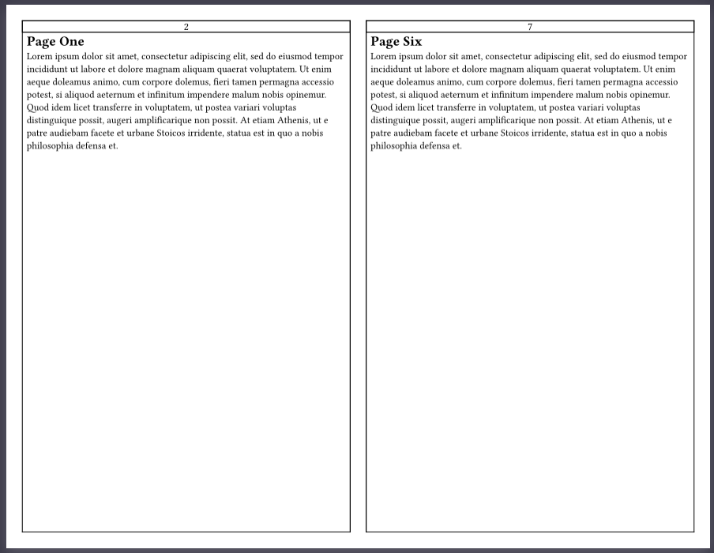

# Bookletic :book:
Create beautiful booklets with ease.

The current version of this library (0.3.2) contains a single function to take in an array of content blocks and order them into a ready to print booklet, bulletin, etc. No need to fight with printer settings or document converters. 

### Example Output

Here is an example of the output generated by the `sig` function (short for a book's signature) with default parameters and some sample content:



Here is an example with some customization applied:


## How to Import Library

To use through preview: `#import "@preview/bookletic:0.3.2"` 

To use on a local clone of the library: `#import "..\src\lib.typ"`

To use on a clone to the Typst app: `#import "bookletic.typ"` 

## `sig` Function

The `sig` function is used to create a signature (booklet) layout from provided content. It takes various parameters to automatically configure the layout. 

### Parameters

- `page_margin_binding`: The binding margin for each page in the booklet (space between pages).
- `page_border`: Takes a color space value to draw a border around each page. If set to none no border will be drawn.
- `draft`: A boolean value indicating whether to output an unordered draft or final layout.
- `p-num-layout`: A configuration for page numbering styles, allowing multiple layouts that apply to specified page ranges. Each layout can be provided as a dictonary specifying the following options:
  - `num-layout`: An individual page number layout can accept the following parameters: 
    - `p-num-start`: Starting page number for this layout to begin taking affect.
    - `p-num-alt-start`: Alternative page number to begin numbering from (e.g. for introduction, chapters, etc.)
    - `p-num-pattern`: Pattern for page numbering (e.g., `"1"`, `"i"`, `"a"`, `"A"`)
    - `p-num-placment`: Placement of page numbers (`top` or `bottom`)
    - `p-num-align-horizontal`: Horizontal alignment of page numbers (`left`, `center`, or `right`)
    - `p-num-align-vertical`: Vertical alignment of page numbers (`top`, `horizon`, or `bottom`)
    - `p-num-pad-left`: Extra padding added to the left of the page number
    - `p-num-pad-horizontal`: Horizontal padding for page numbers
    - `p-num-size`: Size of page numbers
    - `p-num-border`: The border color for the page numbers. If set to none no border will be drawn.
    - `p-num-halign-alternate`: A boolean for whether to alternate horizontal alignment between left and right pages.
  - `num-layout`: You may add as many additional layouts as desired to accomodate different styles of numbering over different sections. 
- `pad_content`: The padding around the page content.
- `contents`: The content to be laid out in the booklet. This should be an array of blocks.

### Usage

To use the `sig` function, first set your desired page settings using the native page function. Then simply call the sig function with the desired parameters and provide the content to be laid out in the booklet:

```typst
#set page(flipped: true, paper: "us-letter")
#bookletic.sig(
  contents: (
    ["Page 1 content"],
    ["Page 2 content"],
    ["Page 3 content"],
    ["Page 4 content"],
  ),
)
```

This will create a signature layout with the provided content, using the default values for the other parameters.

You can customize the layout by passing different values for the various parameters. For example:

```typst
#set page(flipped: true, paper: "us-legal", margin: (top: 1in, bottom: 1in, left: 1in, right: 1in))
#bookletic.sig(
  page-margin-binding: 0.5in,
  page-border: none,
  draft: true,
  p-num-layout: ( // Each entry in the p-num-layout array allows defining a specific style of page numbers starting from the specified page
    bookletic.num-layout( 
      p-num-start: 1, // Beginning Page for this page number layout
      p-num-pattern: none, // Adding none here will remove page numbers for this section
    ),
    bookletic.num-layout(
      p-num-start: 2,
      p-num-alt-start: 1, // Adding none here will continue numbering the pages using their physical page number but we want to start from one
      p-num-pattern: "I", // Pattern for page numbering
      p-num-placement: bottom, // Placement of page numbers (top or bottom)
      p-num-align-horizontal: center, // Horizontal alignment of page numbers
      p-num-halign-alternate: false,
      p-num-align-vertical: top, // Vertical alignment of page numbers
      p-num-pad-left: 90%, // Extra padding added to page number
      //Note: Extra padding does not work when horizontal alignment is set to left or right
      p-num-pad-horizontal: 5pt, // Horizontal padding for page numbers
      p-num-size: 20pt, // Size of page numbers
      p-num-border: none, // Border color for page numbers
    ),
    bookletic.num-layout(
      p-num-start: 3,
      p-num-alt-start: 1, // Specifing a number here will start numbering this section from that number. In this case starting from one again
      p-num-pattern: (..nums) => 
                  box(inset: 3pt, text(size: 15pt, 
                  sym.lt.double )) + " " 
                  + nums
                    .pos()
                    .map(str)
                    .join(".") 
                  + " " + box(inset: 3pt, text(size: 15pt, sym.gt.double)), 
                  // This is how to use custom symbols around page numbers
      p-num-placement: top, 
      p-num-align-horizontal: center, 
      p-num-halign-alternate: false,
      p-num-align-vertical: horizon, 
      p-num-pad-left: 0pt,
      p-num-pad-horizontal: 1pt, 
      p-num-size: 18pt, 
      p-num-border: oklab(27%, 20%, -3%, 50%), 
    ),
     bookletic.num-layout(
      p-num-start: 8,
      p-num-pattern: none
    ),
  ),
  pad-content: 10pt,
  contents: (
    ["Page 1 content"],
    ["Page 2 content"],
    ["Page 3 content"],
    ["Page 4 content"],
    ["Page 5 content"],
    ["Page 6 content"],
    ["Page 7 content"],
    ["Page 8 content"],
  ),
)
```

This will create an unordered draft signature layout with US Legal paper size, larger margins, no page borders, and a variety of page numbers across the pages.

### Notes
- The `sig` function is currently hardcoded to only handle two-page single-fold signatures. This means that it supports 4, 8, 12, etc. page signatures without any blank pages. If you feed it an odd number of pages, it will opt for laying out your pages in the closest size signature possible. It accomplishes this by inserting needed blank pages at the end of the signature. An example of how this works is if you start with five pages of content the sig function will create an eight page signature (two sheets front and back) adding the three needed blank pages to the back of the signature. If you would like to shift where these blank pages are in the signature you can feed the sig function empty pages at the beginning of the contents array.
- Other more complicated signatures may be supported in the future. Please reach out to ask if you have one in particular that is useful for you!
- The `num-layout` function is a helper that can be fed to the p-num-layout parameter to create page number layouts with default values.
- The `booklet` function is a placeholder for automatically breaking a single content block into pages dynamically. It is not implemented yet due to limitations with typst. It is hoped that these limitations will be lifted in the future.

## Collaboration
I would love to see this package eventually turn into a community effort. So any interest in collaboration is very welcome! You can find the github repository for this library here: [Bookletic Repo](https://github.com/harrellbm/Bookletic). Feel free to file an issue, pull request, or start a discussion. 

## Changlog
#### 0.3.1 and 0.3.2
- Maintenance updates for continued compatibility with Types 0.13.0.
- Typo and other minor fixes and expansions for examples and documentation.
  
#### 0.3.0
- Remove internal dependency on native page function. This allows the user to set the page function separately with full control over paper type, outer margins and everything else defined by the native page function.
- Add p-num-halign-alternate to page number layout allowing setting page numbers to alternate on facing pages making it possible to place page numbers along the outside or inside edges of facing pages.
- Internal improvements for ordering algorithm.
- Add `num-layout` function helper.
  
#### 0.2.0
- Handle odd number of pages by inserting a blank back cover
- Implements page number layouts to allow defining different page numbers for different page ranges.
- Add various other page number options

#### 0.1.0
Initial Commit
